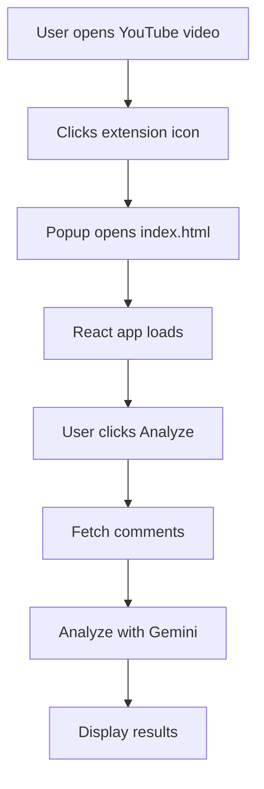

Chrome extension to do youtube comments sentiment analysis :

1. **Extension Structure**
```
root/
├── src/                    # Source code directory
│   ├── utils/             # Utility functions
│   │   ├── llmApi.js      # Gemini API integration
│   │   └── youtubeApi.js  # YouTube API integration
│   ├── App.jsx            # Main React component
│   ├── main.jsx          # React entry point
│   ├── index.css         # Styles
│   └── content.js        # Chrome content script
├── manifest.json          # Extension configuration
├── index.html            # Popup HTML
└── vite.config.js        # Build configuration
```

2. **Key Components Explained**

a. **manifest.json**
```json
{
  "manifest_version": 3,  // Latest manifest version
  "name": "YouTube Sentiment Analyzer",
  "version": "1.0",
  "permissions": [
    "activeTab",  // Allows access to current tab
    "storage"     // Allows data storage
  ],
  "host_permissions": [
    "https://*.youtube.com/*"  // Allows access to YouTube domains
  ],
  "action": {
    "default_popup": "index.html"  // UI that appears when clicking extension icon
  },
  "content_scripts": [  // Scripts that run on matching web pages
    {
      "matches": ["https://*.youtube.com/*"],
      "js": ["assets/content.js"]
    }
  ]
}
```

b. **How Different Parts Work Together**:

1. **Popup (React Application)**
- When you click the extension icon, `index.html` loads
- This loads `main.jsx` which renders the React app
- `App.jsx` contains the UI and logic for sentiment analysis
```jsx
// Simplified App.jsx flow
function App() {
  // When opened, get current tab's YouTube video ID
  useEffect(() => {
    chrome.tabs.query({ active: true, currentWindow: true }, ...)
  }, []);

  // When "Analyze" clicked:
  const analyzeComments = async () => {
    // 1. Fetch comments using YouTube API
    const comments = await fetchComments(videoId);
    // 2. Analyze using Gemini
    const sentiment = await analyzeSentiment(comments);
    // 3. Display results
    setSentiment(sentiment);
  };
}
```

2. **API Integration**
- `youtubeApi.js` fetches video comments:
```javascript
// Fetches top 100 comments from a video
export async function fetchComments(videoId) {
  const response = await fetch(
    `https://www.googleapis.com/youtube/v3/commentThreads?...`
  );
  // Returns array of comment texts
}
```

- `llmApi.js` analyzes sentiment:
```javascript
// Sends comments to Gemini API for analysis
export async function analyzeSentiment(comments) {
  // Combines comments and requests analysis
  const response = await fetch(GEMINI_API_URL, ...);
  // Returns sentiment scores {positive: 0.7, negative: 0.3}
}
```

3. **Environment Variables**
```env
VITE_YOUTUBE_API_KEY=xxx    # YouTube Data API key
VITE_GEMINI_API_KEY=xxx     # Google Gemini API key
```
- Keys are loaded during build
- Accessed in code via `import.meta.env.VITE_KEY_NAME`

3. **How It All Works Together**:

1. **Installation**
- User loads unpacked extension
- Chrome reads `manifest.json`
- Creates extension icon in toolbar

2. **Usage Flow**


3. **Behind the Scenes**
- Content script (`content.js`) runs on YouTube pages
- Popup script can communicate with content script
- APIs are called from popup context
- Results are displayed in popup UI

4. **Development Workflow**:
```bash
# 1. Make changes to code
# 2. Build extension
npm run build
# 3. Extension files are generated in dist/
# 4. Load/reload extension in Chrome
```

5. **Security**:
- API keys are built into the extension
- Content security policies protect from XSS
- Host permissions limit where extension can run

6. **Debugging**:
- Use Chrome DevTools for popup
- Console logs appear in extension's developer tools
- Network tab shows API requests

This extension demonstrates:
- Chrome Extension Architecture
- React Integration
- API Integration
- Environment Configuration
- Security Considerations
- Modern Build Tools (Vite)
